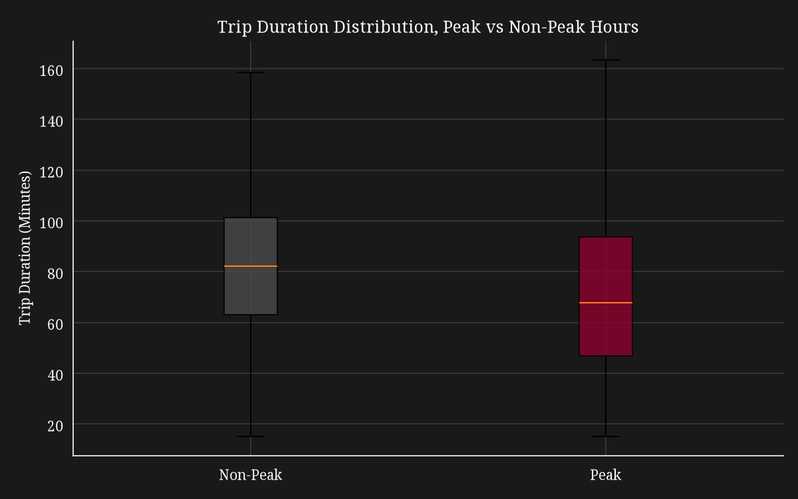
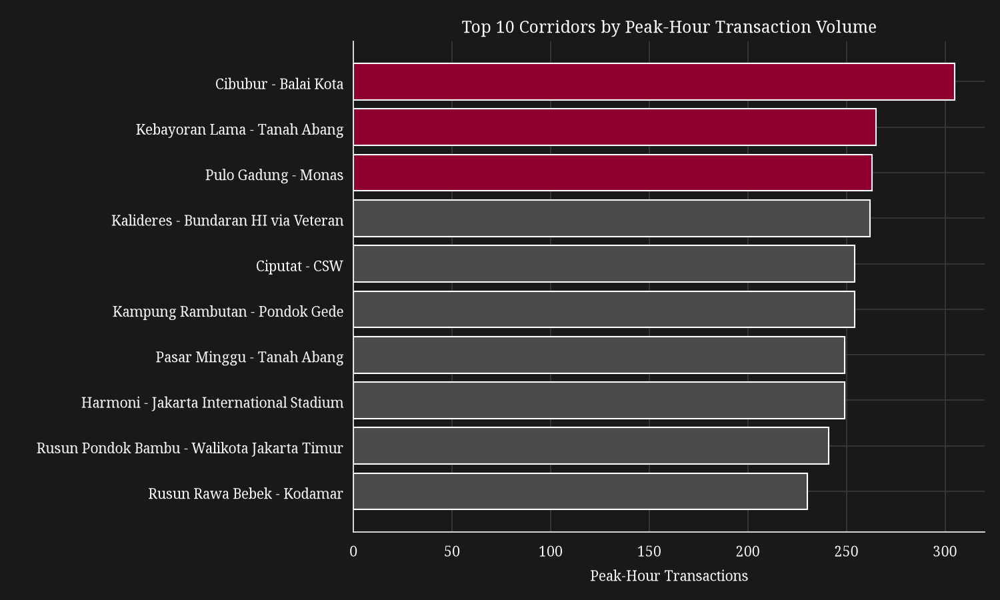

# Transjakarta: Peak-Hour Congestion and Fleet Scheduling Analysis

A data analysis project examining ridership time concentration, trip duration
patterns, and corridor-level demand for Transjakarta, Jakarta's Bus Rapid
Transit system, using tap-in/tap-out transaction data.

## Business Question

Where and when is Transjakarta most congested, and which corridors should be
prioritized for additional fleet allocation during peak hours?

## Key Findings

- **Ridership is heavily time-concentrated, not corridor-concentrated**: 8
  peak hours (5-9am, 16, 17, 19) account for 76.5% of all 37,900 monthly
  transactions, while peak-hour volume is spread thinly across 216
  corridors, the top 3 corridors combined account for only 3.1% of
  peak-hour volume.
- **Peak-hour trips are faster, not slower, than off-peak trips**: 69.4 vs
  81.2 minutes on average (Welch's t-test, p < 0.00001), even after
  controlling for distance traveled.
- **Trip duration alone cannot confirm in-vehicle crowding**: it measures
  tap-in to tap-out time, a mix of wait and travel time, so peak-hour
  overcrowding remains a real but separately unconfirmed risk.

## Recommendations

1. Prioritize **time-based** fleet scheduling (more buses during the 8 peak
   hours, system-wide) over corridor-based reallocation, the data does not
   support concentrating fleet increases on a small handful of routes.
2. Investigate **off-peak service frequency**, not peak-hour congestion, as
   the more likely source of long end-to-end trip times.
3. Treat peak-hour **crowding** as an open question requiring vehicle
   capacity or passenger-count data this dataset does not contain.

## Visuals





## Data

This project uses Transjakarta tap-in/tap-out transaction records for April
2023, containing 37,900 trips across 221 corridors. Rider-level fields (card
bank, name, sex, birth year) and fare amount were excluded, as they relate
to rider identity and revenue questions outside this project's congestion
scope.

## Limitations

This analysis covers a single month of data and does not include fleet
size, dispatch schedules, or vehicle capacity data. The peak-hour definition
was derived from this dataset's own volume distribution (top third of hours
by transaction count) rather than an official operational schedule.

## Tools

Python, pandas, numpy, matplotlib, scipy, Jupyter Notebook

## How to Run

1. Clone or download this repository
2. Create and activate a virtual environment:
   `python -m venv venv` then `.\venv\Scripts\Activate.ps1` (Windows)
3. Install dependencies: `pip install -r requirements.txt`
4. Open `notebooks/Transjakarta_Congestion_Analysis.ipynb` in Jupyter or VS
   Code, and select the `venv` kernel
5. Run all cells

## Repository Structure

```
Transjakarta-Congestion-Analysis/
├── data/
│ ├── processed/
│ |   └── transjakarta_congestion_cleaned.csv
│ ├── raw/
│ |   └── dfTransjakarta.csv
│ └── Transjakarta.docx
├── images/
│ ├── duration_peak_vs_nonpeak.png
│ ├── hourly_transaction_volume.png
│ └── top_corridors_peak_volume.png
├── notebooks/
│ └── Transjakarta_Congestion_Analysis.ipynb
├── README.md
└── requirements.txt
```

## Full Analysis

See the full notebook for detailed methodology, data cleaning steps, and
findings for each section: notebooks/Transjakarta_Congestion_Analysis.ipynb
