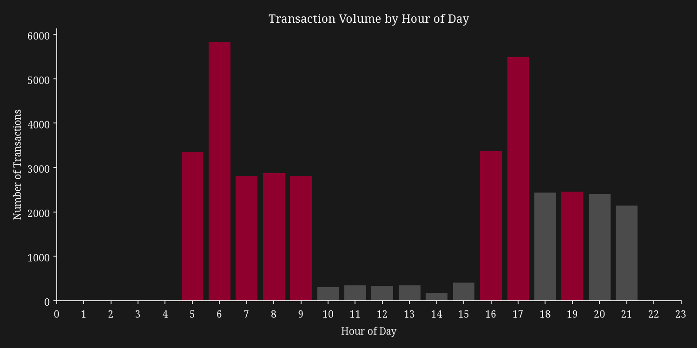

# Transjakarta Peak-Hour Congestion Analysis

**Where and when is Transjakarta most congested, and which corridors should
be prioritized for additional fleet allocation during peak hours?**



76.5% of ridership is concentrated in just 8 of the day's 24 hours. This
project identifies exactly when that congestion happens, whether it actually
slows trips down, and where the current recommendation should focus.

## Key Findings

1. **Ridership is heavily time-concentrated, not corridor-concentrated.**
   8 peak hours (5-9am, 16, 17, 19) account for 76.5% of all 37,900 monthly
   transactions, while peak-hour volume is spread thinly across 216
   corridors, the top 3 corridors combined account for only 3.1% of
   peak-hour volume.

2. **Peak-hour trips are faster, not slower, than off-peak trips**, even
   after controlling for distance traveled (69.4 vs 81.2 minutes on average,
   Welch's t-test, p < 0.00001). This suggests current peak-hour service
   frequency already handles demand efficiently, while off-peak service may
   be the bigger, less obvious gap.

3. **Trip duration alone cannot confirm in-vehicle crowding.** It measures
   tap-in to tap-out time, a mix of wait and travel time, so peak-hour
   overcrowding remains a real but separately unconfirmed risk.

## Recommendations

1. Prioritize **time-based** fleet scheduling (more buses during the 8 peak
   hours, system-wide) over corridor-based reallocation, the data does not
   support concentrating fleet increases on a small handful of routes.
2. Investigate **off-peak service frequency**, not peak-hour congestion, as
   the more likely source of long end-to-end trip times.
3. Treat peak-hour **crowding** as an open question requiring vehicle
   capacity or passenger-count data this dataset does not contain.

## Repository Structure

```
Transjakarta-Congestion-Analysis/
├── data/
│ ├── processed/
│ |   └── transjakarta_congestion_cleaned.csv
│ ├── raw/
│ |   └── dfTransjakarta.csv
│ └── Transjakarta.docx
├── images/
│ ├── duration_peak_vs_nonpeak.png
│ ├── hourly_transaction_volume.png
│ └── top_corridors_peak_volume.png
├── notebooks/
│ └── Transjakarta_Congestion_Analysis.ipynb
├── README.md
└── requirements.txt
```


## Data Source

Transjakarta tap-in/tap-out transaction records for April 2023, 37,900
trips across 221 corridors. Rider-level fields (card bank, name, sex, birth
year) and fare amount were excluded from this analysis, as they are outside
the scope of a congestion question.

## Tools Used

Python (pandas, numpy, matplotlib, seaborn, scipy) in Jupyter Notebook.

## How to Reproduce

```powershell
python -m venv venv
.\venv\Scripts\Activate.ps1
pip install -r requirements.txt
```

Then open `notebooks/Transjakarta_Congestion_Analysis.ipynb` in VS Code or
Jupyter and select the `venv` kernel.

## Limitations

This analysis covers a single month of data and does not include fleet
size, dispatch schedules, or vehicle capacity data. The peak-hour definition
was derived from this dataset's own volume distribution (top third of hours
by transaction count) rather than an official operational schedule.
